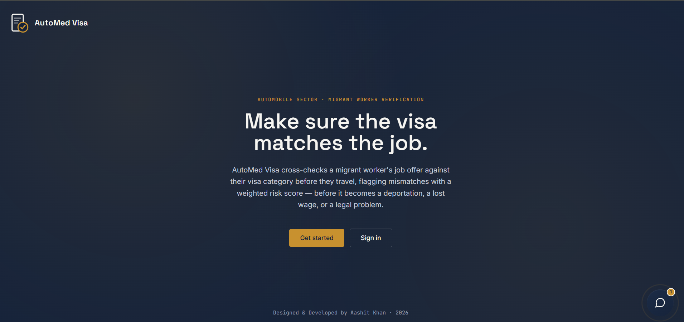
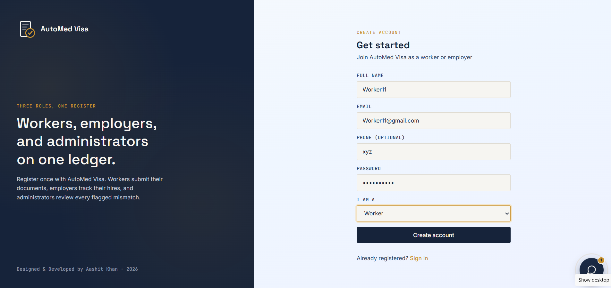
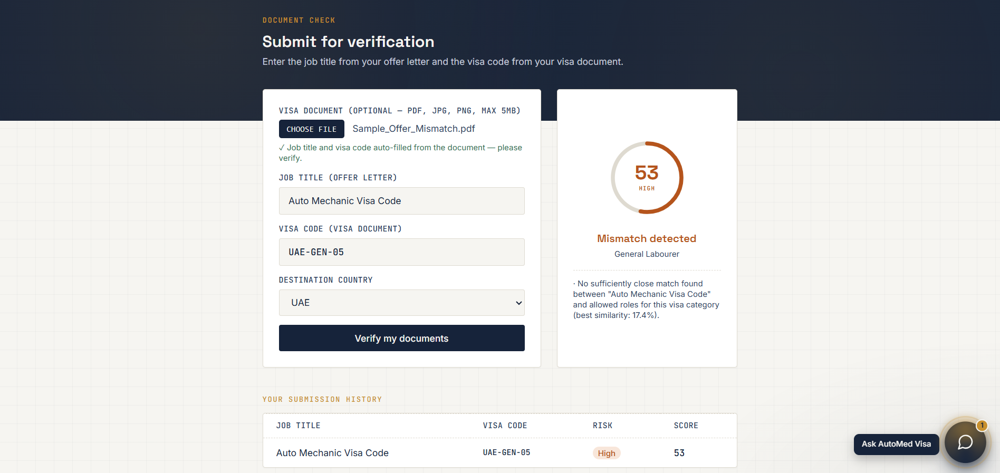
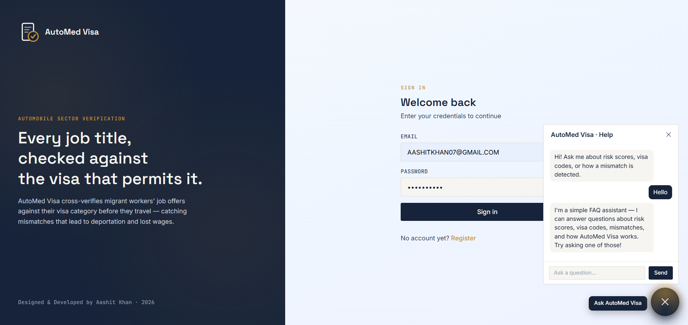
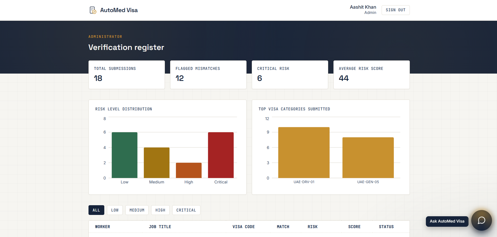
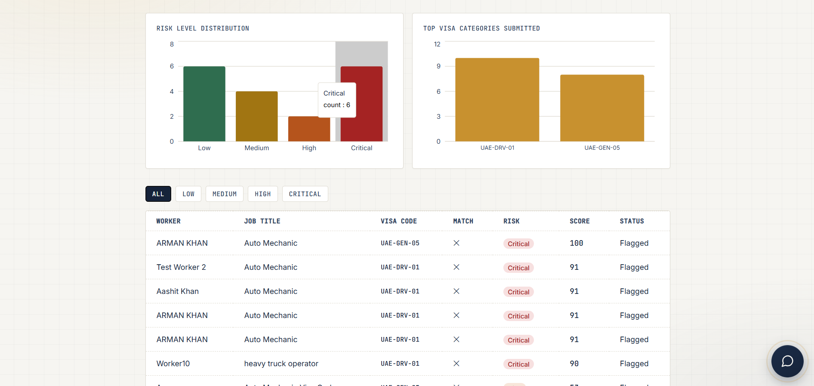

# AutoMed Visa

A full-stack MERN application that verifies automobile-sector migrant workers'
job titles against their visa categories before travel, flagging mismatches
using a custom risk-scoring algorithm (Levenshtein distance).

## Live Demo
- Frontend: https://automedvisa.vercel.app
- Backend API: https://automed-backend.onrender.com

## Why I Built This
Migrant workers travelling for automobile-sector jobs are often issued a visa
category that doesn't match their actual job role, due to a lack of awareness
about the verification process. This leads to serious challenges — deportation,
legal trouble, and financial loss — with no automated check available today.
AutoMed Visa solves this by cross-verifying job offers against visa categories
before travel.

## Features
- JWT authentication (worker / employer / admin roles)
- OCR-based document auto-fill (Tesseract.js + pdf.js)
- Custom DSA risk-scoring engine (Levenshtein distance)
- Admin analytics dashboard with charts
- Rule-based chatbot assistant
- Email notifications (Nodemailer)

## Tech Stack
**Frontend:** React, Vite, Tailwind CSS, Recharts, Tesseract.js, pdf.js, Axios
**Backend:** Node.js, Express, MongoDB, Mongoose, JWT, Multer, Nodemailer
**Testing:** Jest, Supertest

## Screenshots

| Welcome | Registration |
|---|---|
|  |  |

| Submit & Risk Result | Login with Chatbot |
|---|---|
|  |  |

| Admin Panel | Submission History |
|---|---|
|  |  |

### Demo Video
https://github.com/user-attachments/assets/demo-video-link

## Pages
- `/register` — create worker/employer account
- `/login` — login
- `/submit` — worker: enter job title + visa code, or upload a document for OCR auto-fill; view match result + risk score
- `/dashboard` — admin only: table of all submissions with analytics, filterable by risk level

## Local Setup

### Backend
```bash
cd backend
npm install
cp .env.example .env
npm run dev
```

### Frontend
```bash
cd frontend
npm install
npm run dev
```

## Test Flow
1. Register a normal account (role: worker) → auto-redirects to `/submit`
2. Enter job title "Auto Mechanic" and visa code "UAE-DRV-01" → should show a Critical risk mismatch
3. To see the admin dashboard, register a second account and manually change its `role` to `"admin"` in MongoDB (via mongosh or MongoDB Compass), then log in with that account

## Implementation Notes
- Auth token stored in `localStorage`
- Tailwind is loaded via CDN script in `index.html`
- OCR runs entirely client-side (no server round-trip for text extraction)

## Backend Repository
https://github.com/tumhara-username/automed-visa-backend

## Author

**Aashit Khan**
- GitHub: [@tumhara-username](https://github.com/tumhara-username)